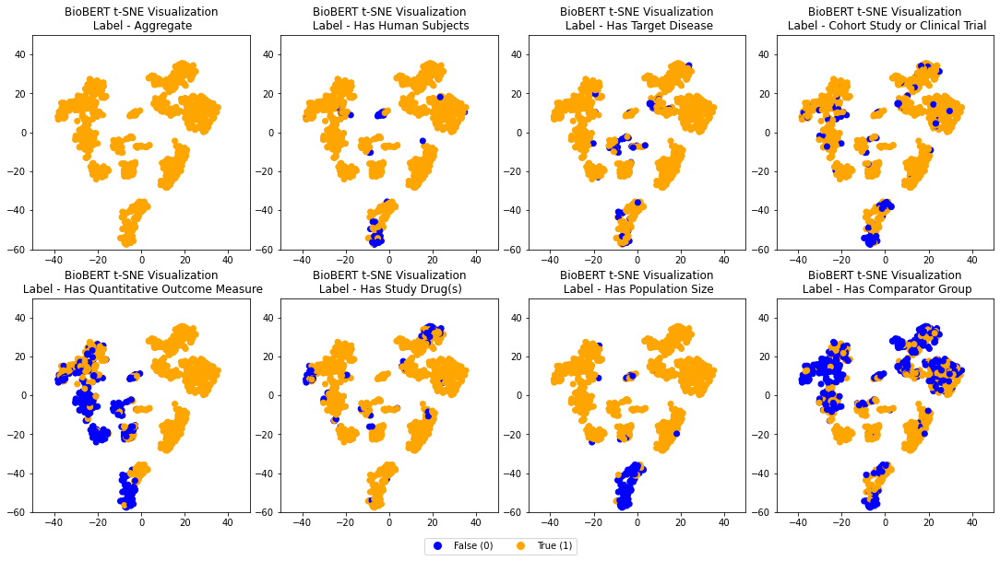
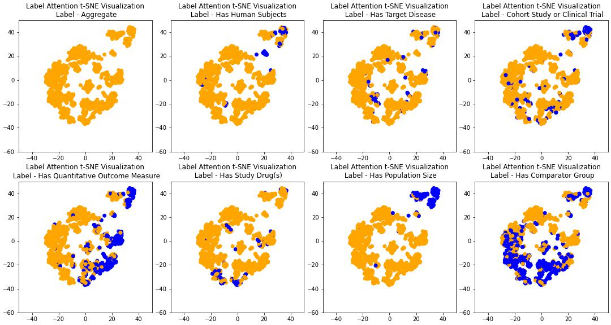

# BioSift
Repository containing code to replicate BioSift benchmark ([repo](https://github.com/pathology-dynamics/biosift), [paper](https://dl.acm.org/doi/abs/10.1145/3539618.3591897)) results including additional experiments. 
---
## Benchmarks

`/benchmarks/` includes code to replicate supervised benchmarks including a distributed implementation and HPO optimization implementation using Population-Based Training. Additionally includes raw results from test runs. 

## Dataset

`/datasets/` contains dataset compilation scripts for the binary-labeled dataset, soft-labeled dataset, and zero-shot (NLI) dataset. This directory also includes code to scrape PubMed to create a dataset of candidate abstracts in line with the methods in the original paper. 

## Label Attention

`/label_attention/` includes an implementation of the label attention architecture introduced by Song et al. for multi-label legal document classification ([paper](https://dl.acm.org/doi/10.1016/j.is.2021.101718)) without the additional low-class training objective. Also included is code to run the label-attended model on the binary-labeled Biosift dataset as well as code to visualize the final CLS embeddings for the test set using t-SNE.

### Supervised Embeddings

### Label-Attended Embeddings

